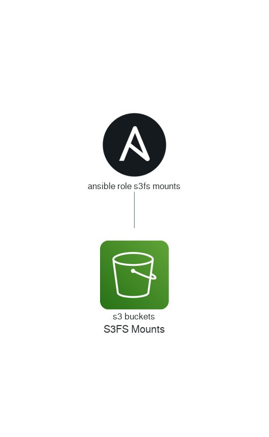

# Ansible Role: S3FS-Mounts

Mount aws s3 buckets with s3fs-fuse 

## Tags:

* `s3` - AWS S3 Bucket

* `s3fs-fuse` - S3FS

* `fuse` - FUSE

## Variables:

* `s3fs_mounts`: `[]` - a list of S3 buckets and filesystem mount paths

## License
Mit

## Author Information
This role:  was created by: Ben fortuna

Documentation generated using: [Ansible-autodoc](https://github.com/AndresBott/ansible-autodoc)

